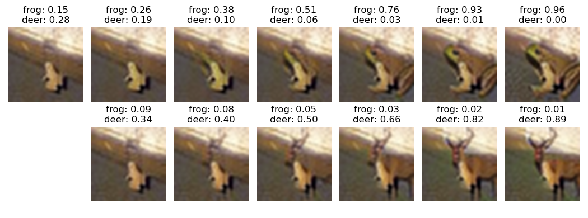

# Adversarial Robustness on In- and Out-Distribution Improves Explainability

This is the official repository for the ECCV paper [Adversarial Robustness on In- and Out-Distribution Improves Explainability](https://arxiv.org/abs/2003.09461).

We have updated the source code to reflect the findings of the newer survey paper [Uncovering the Limits of Adversarial Training against Norm-Bounded Adversarial Examples](https://arxiv.org/abs/2010.03593).
The changes to our original paper include:
1. Use of a larger model architecture (WideResNet34x10 instead of ResNet50)
2. Fixed number of attack steps (10/20 instead of increasing schedule)
4. Averaging of model weights (EMA)
3. Optional: Additional unlabeled data from [500k-TI](https://arxiv.org/abs/1905.13736)

For CIFAR10 only training. we found AutoAugment to improve
robustness whereas it decreases performance when combined with 500k-TI. All models with additional data
are thus trained with default (crop + mirror) augmentation only.
We also include the option to use [Auto-PGD](https://arxiv.org/abs/2003.01690) (APGD) during training which can help to increase robustness even further.

Results for the new models trained with an in-distribution radius of 0.5 and an out-distribution radius of 1.0 are given in the following table, robustness values are evaluated using the [AutoAttack package](https://github.com/fra31/auto-attack).
The model checkpoints are available [here](https://drive.google.com/file/d/1qxHvb3DoVEtbFy0r1Lz6dp0qUa-_NrtI/view?usp=sharing).
To use these models, simply extract the .zip file in the project directory.

|       | Clean Accuracy | Robust Accuracy (0.5) |
|--------------|----------------|-----------------------|
| CIFAR10 PGD  | 92.23          | 76.25                 |
| CIFAR10 APGD | 91.09          | 76.42                 |
| 500k-TI PGD  | 93.96          | 78.79                 | 
| 500k-TI APGD | 93.70          | 79.24                 |

### Setup
Before running the code, you will have to update the base dataset path variable in Line 8 in:

> utils.datasets.path

Cifar10/100 will be downloaded automatically. For training your own models, you will have to manually place the 80 Million Tiny Images .bin file in a subdirectory:
"80M Tiny Images" 

If you want to train models on 500k-TI, download "ti_500K_pseudo_labeled.pickle" from the authors Github and place it into a subdirectory "cifar10_ti_500k"
in your datasets folder. 

### Creating Counterfactuals
To create counterfactual explanations for a trained model, you have to run:

> cifar10_visualize_failure.py

By default, we create 100 counterfactual explanations for our 4 pretrained models, however new models can be added by 
changing the "model_descriptions" variable. 

The results can be found in the "Cifar10Eval" directory.

### Robustness evaluation
To evaluate our models on the CIFAR10 test set, run:

> cifar10_robustness_test.py

Note that this requires the [AutoAttack package](https://github.com/fra31/auto-attack).
### Training new models
To train a new model on CIFAR10, use 

> run_training_cifar10.py

To replicate above models, use one of the following commands:

CIFAR10 PGD:

> python run_training_cifar10.py --gpu 0 1 --net wideresnet34x10 --augm autoaugment_cutout --id_steps 10 --od_steps 20 --train_type advacet --epochs 300 --ema True --ema_decay 0.999 --test_epochs 10 --dataset cifar10 --schedule cosine --l2_eps 0.5  --od_eps_factor 2

CIFAR10 APGD:

> python run_training_cifar10.py --gpu 0 1 --net wideresnet34x10 --augm autoaugment_cutout --id_steps 10 --od_steps 20 --id_pgd apgd --od_pgd apgd --train_type advacet --epochs 300 --ema True --ema_decay 0.999 --test_epochs 10 --dataset cifar10 --schedule cosine --l2_eps 0.5  --od_eps_factor 2

500k-TI PGD:

> python run_training_cifar10.py --gpu 0 1 --net wideresnet34x10 --augm default --id_steps 10 --od_steps 20 --train_type advacet --epochs 300 --ema True --ema_decay 0.999 --test_epochs 10 --dataset semi-cifar10 --schedule cosine --l2_eps 0.5  --od_eps_factor 2

500k-TI APGD:

> python run_training_cifar10.py --gpu 0 1 --net wideresnet34x10 --augm default --id_steps 10 --od_steps 20 --id_pgd apgd --od_pgd apgd --train_type advacet --epochs 300 --ema True --ema_decay 0.999 --test_epochs 10 --dataset semi-cifar10 --schedule cosine --l2_eps 0.5  --od_eps_factor 2
